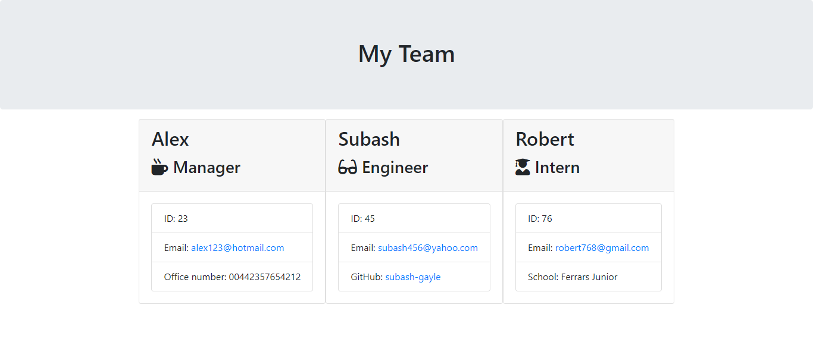
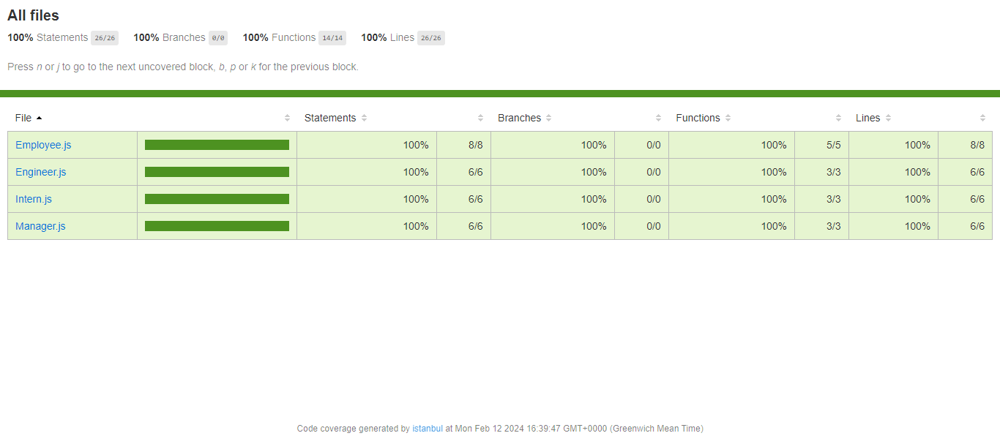

# team--profile-generator
Empower's team identity with Team profile generator. A user friendly tool designed for quick and concise team introductions.

## Screenshot of HTML and test result in jest after added --coverage:

. (jest--coverage) in package.json. This will create a new folder coverage & in coverage another folder Icov-report, when visit in there, it is index.html file there which gives us 100% result of test.)

## Project Overview:

This project aims to create a command-line application in Node.js to generate a webpage displaying basic information about a software engineering team.

## Classes:

The code includes classes for different team members: Employee, Manager, Engineer, and Intern.
Each class has properties and methods to store and retrieve information about team members.

## User Input:

The application uses Inquirer to prompt the user for details about team members.
For a manager, the user provides the name, employee ID, email, and office number.
For engineers, the user provides the name, employee ID, email, and GitHub username.
For interns, the user provides the name, employee ID, email, and school.

## HTML Generation:

The application utilizes a render function to generate an HTML webpage.

## File Output:
The generated HTML is written to a file named team.html in the output folder.

## Usage:

The user runs the application using the command node index.js.
The application guides the user through adding the manager and additional team members (engineers or interns).
The user can finish building the team when all members are added.

## Dependencies:

The application uses Jest for running unit tests and Inquirer for collecting user input.

## Tests:

Unit tests for the classes are provided in the _tests_ folder.
All tests have passed and sharing the screenshot as using coverage in jest to ensure the correct functionality of the application and showing 100% work.

## Result:

The application generates an HTML file in the output folder, providing quick access to team members' emails and GitHub profiles.